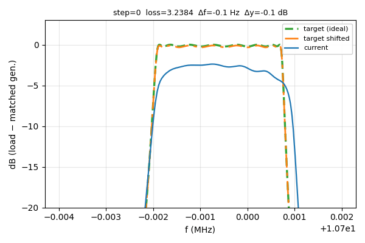
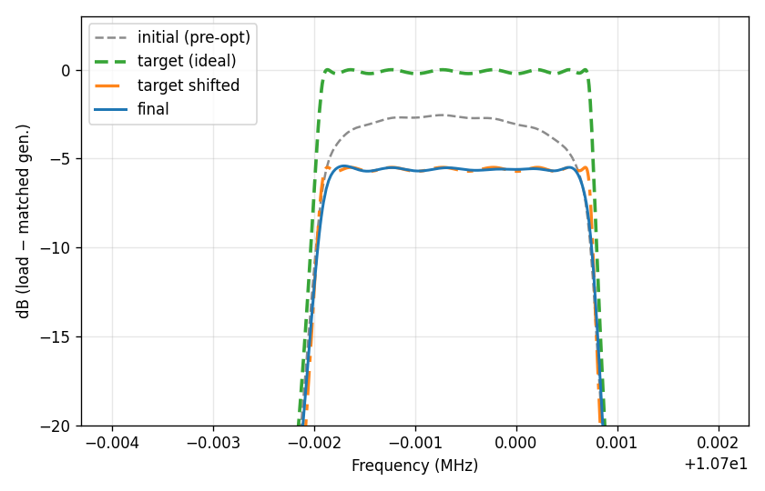

**[Русская версия](README_ru.md)**

# Crystal bandpass filter optimizer

A **PyTorch** tool for **tuning ladder bandpass crystal filters** so their **frequency response follows an ideal reference** even when resonators are **lossy**. It compensates for crystal non-ideality that **Dishal-style synthesis usually skips**—and that otherwise **distorts passband shape** (narrower band, worse flatness, extra loss).

**Repository:** [github.com/MatthewMih/crystal-rf-filter-optimizer](https://github.com/MatthewMih/crystal-rf-filter-optimizer)  
**Author:** Matthew Mih  
**Full reference (JSON schema, CLI, API, loss weighting — Russian):** [docs/DOCUMENTATION.md](docs/DOCUMENTATION.md)

---

## Why this exists

Classic ladder design flows (e.g. **Dishal** and similar) usually assume **ideal crystals**: infinite Q, no series loss. Real quartz resonators have **finite Q** and **motional resistance** \(R_m\) (Butterworth–Van Dyke model). The passband gets **narrower**, **in-band flatness** suffers, and you see **extra insertion loss** versus the ideal curve.

This project lets you:

1. Build a **target** response from a JSON circuit: set the **ideal** topology and resonator data, with **\(R_m = 0\)** (lossless motional branch) for the reference.  
2. Describe a **realistic** circuit with the **same topology**: **trainable** capacitor values and **port impedance**, and **fixed crystal parameters** matching your resonators (same as in step 1, but with the real \(R_m\)).  
3. Run **gradient-based optimization** (Adam, optional LBFGS) so the **non-ideal** network’s response **matches the target shape** in dB on the chosen frequency grid.

You still need physically realizable parts and sensible starting values; the optimizer **adjusts the parameters you mark as trainable**—it does not replace classical filter theory.

---

## Example (after optimization)

How the **frequency response evolves** while optimizing capacitor values for a **~10.7 MHz Chebyshev-type ladder** (see [docs/DOCUMENTATION.md](docs/DOCUMENTATION.md) for the dB axis: load power vs matched generator).

- **target** (green) — ideal lossless reference  
- **target shifted** (orange) — same reference with learnable frequency / level offset  
- **current** (blue) — real lossy network **during** optimization  



*Animation: `examples/ladder_optimize.json` (750 steps, `shifted_pred_max_decay`, `slope_db: 20`); after the quick start below you get the same view in `examples/ladder_run/optimization_yzoom.gif`. The `docs/assets/` file is a snapshot of that run.*

**Before → after (zoomed Y-axis):** gray dashed **initial (pre-opt)** — response with nominal values and finite \(R_m\) *before* optimization (what you often get if you build from Dishal-style numbers without re-tuning for crystal loss); **final** (blue) — *after* fitting to the target. Green and orange — ideal lossless target without and with shift. The tight Y window comes from `rebuild_optimization_gif_yzoom.py`.



*Still frame from `examples/ladder_run/final_yzoom.png`; copy in `docs/assets/` for GitHub.*

---

## Features (short)

- JSON circuit: nodes, branches, shared named parameters.  
- Elements: `Resistor`, `Capacitor`, `Inductor`, `Impedance`, `VoltageSource`, **`Crystal` (BVD: Rm, Lm, Cm, Cp)**, `CrystalLCC`.  
- **MNA** AC solver, batched over frequency, `torch.linalg.solve`, autodiff through parameters.  
- **`target` mode:** writes `target.npz` and a plot.  
- **`optimize` mode:** L1/L2 in dB, **frequency-dependent loss weights**, learnable target shifts `delta_f` / `delta_y`, GIF and parameter snapshots.  
- Helper script [`scripts/rebuild_optimization_gif_yzoom.py`](scripts/rebuild_optimization_gif_yzoom.py) to rebuild a **Y-zoomed** GIF from saved parameter frames.

---

## Requirements

Python ≥ 3.10, PyTorch 2.x, NumPy, Matplotlib, Pillow (see `requirements.txt`).

---

## Install

```bash
cd crystal-rf-filter-optimizer
python3 -m pip install -e .
```

---

## Quick start (ladder ~10.7 MHz)

From the repo root:

```bash
python3 -m xtal_filters target \
  --config examples/ladder_ideal.json \
  --out examples/ladder_target \
  --device cpu

python3 -m xtal_filters optimize \
  --config examples/ladder_optimize.json \
  --target examples/ladder_target/target.npz

python3 scripts/rebuild_optimization_gif_yzoom.py \
  --config examples/ladder_optimize.json \
  --run-dir examples/ladder_run \
  --save-final examples/ladder_run/final_yzoom.png
```

Use **`optimization.device`: `cpu` or `cuda`**.

---

## Documentation

| Document | Content |
|----------|---------|
| [docs/DOCUMENTATION.md](docs/DOCUMENTATION.md) | JSON schema, `response` / `optimization`, loss weighting modes, dBm definitions, artifacts, Python API |
| [README_ru.md](README_ru.md) | This page in Russian |

---

## License

[MIT](LICENSE)
