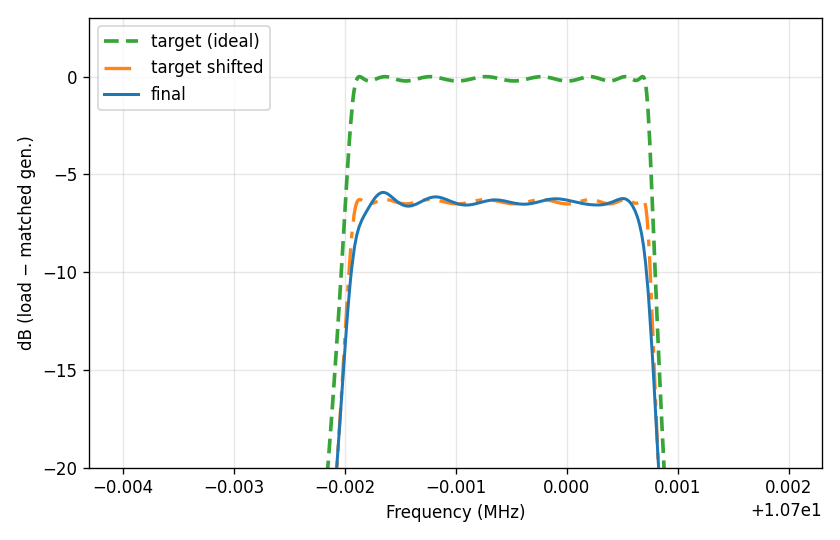

**[English version](README.md)**

# Оптимизатор кварцевых RF-фильтров

Инструмент на **PyTorch** для **подбора параметров лестничных и аналогичных кварцевых фильтров** так, чтобы их **АЧХ в виде мощности на нагрузке** (dBm или dB относительно согласованного генератора) **была близка к заданной цели** — обычно к отклику **идеального** проекта.

**Репозиторий:** [github.com/MatthewMih/crystal-rf-filter-optimizer](https://github.com/MatthewMih/crystal-rf-filter-optimizer)  
**Полная техническая документация (формат JSON, CLI, API, веса loss):** [docs/DOCUMENTATION.md](docs/DOCUMENTATION.md)

---

## Зачем это нужно

В классических методах расчёта лестничных фильтров (в духе **Dishal** и аналогов) кварцы часто считаются **идеальными**: бесконечная добротность, без потерь. У реального резонатора конечная **добротность** и **моциональное сопротивление** \(R_m\) (модель **BVD**). Из‑за этого **полоса сужается**, **ровность полосы** ухудшаются, появляются **дополнительные потери** по сравнению с «учебниковой» кривой.

Эта программа позволяет:

1. Построить **эталонную** АЧХ из JSON-схемы (часто идеальные или номинальные кварцы).  
2. Описать **более реалистичную** схему (та же топология, обучаемые конденсаторы / сопротивление порта, зафиксированные моциональные параметры кварцев).  
3. Запустить **дифференцируемую оптимизацию** (Adam, опционально LBFGS), чтобы отклик **неидеальной** схемы **по форме** приблизился к эталону в децибелах на выбранной сетке частот.

Разумные начальные номиналы и физическая реализуемость по‑прежнему на вас; оптимизатор **подстраивает заданные параметры**, а не заменяет теорию фильтров.

---

## Пример (после оптимизации)

Узкий масштаб по оси Y: **идеальный target**, **сдвинутый target** (малые обучаемые сдвиги по частоте и уровню) и **оптимизированная** лестница (~10.7 МГц, с учётом \(R_m\)). По вертикали — **dB на нагрузке относительно доступной мощности согласованного генератора Thevenin** (подробности в [документации](docs/DOCUMENTATION.md)).



*Рисунок: прогон в духе `examples/ladder_nonideal_opt` с акцентом loss на полосу; файл скопирован из `examples/ladder_opt_slope40/final_yzoom.png`.*

---

## Возможности (кратко)

- Схема в **JSON**: узлы, ветви, общие именованные параметры.  
- Элементы: `Resistor`, `Capacitor`, `Inductor`, `Impedance`, `VoltageSource`, **`Crystal` (BVD: Rm, Lm, Cm, Cp)**, `CrystalLCC`.  
- Уравнения **MNA**, расчёт по частоте пакетом, `torch.linalg.solve`, автоградиенты по параметрам.  
- Режим **`target`:** `target.npz` и график.  
- Режим **`optimize`:** L1/L2 по dB, **веса по частоте**, сдвиги эталона `delta_f` / `delta_y`, GIF и снимки параметров.  
- Скрипт [`scripts/rebuild_optimization_gif_yzoom.py`](scripts/rebuild_optimization_gif_yzoom.py) — пересборка **приближенного** GIF по оси Y.

---

## Зависимости

Python ≥ 3.10, PyTorch 2.x, NumPy, Matplotlib, Pillow (`requirements.txt`).

---

## Установка

```bash
cd crystal-rf-filter-optimizer
python3 -m pip install -e .
```

---

## Быстрый старт (лестница ~10.7 МГц)

Из корня репозитория:

```bash
python3 -m xtal_filters target \
  --config examples/ladder_10p696_10p702MHz.json \
  --out examples/ladder_10p7MHz_out \
  --device cpu

python3 -m xtal_filters optimize \
  --config examples/ladder_nonideal_opt.json \
  --target examples/ladder_10p7MHz_out/target.npz \
  --out examples/my_run

python3 scripts/rebuild_optimization_gif_yzoom.py \
  --config examples/ladder_nonideal_opt.json \
  --run-dir examples/my_run \
  --save-final examples/my_run/final_yzoom.png
```

Используйте **`optimization.device`: `cpu` или `cuda`**. **MPS (Apple)** для этого решателя **не поддерживается** (нет нужной комплексной линейной алгебры).

---

## Документация

| Файл | Содержание |
|------|------------|
| [docs/DOCUMENTATION.md](docs/DOCUMENTATION.md) | Формат JSON, секции `response` / `optimization`, режимы весов, dBm, артефакты, API |
| [README.md](README.md) | Эта страница по-английски |

---

## Лицензия

[MIT](LICENSE)
